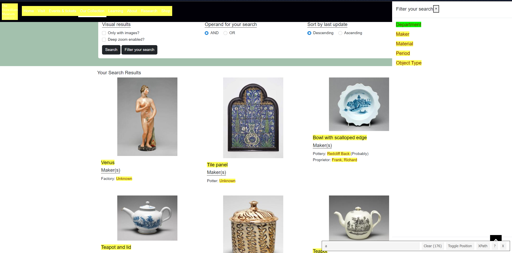

```{r setup, include=FALSE}
knitr::opts_chunk$set(echo = TRUE)
options(tinytex.verbose = TRUE)
knitr::opts_chunk$set(tidy.opts=list(width.cutoff=60), tidy=TRUE)
```

# Introduction

R is a language. Remember this at all times. You do not learn languages in one day. Some people learn languages via apps. Some people learn languages with teachers in classes. Some people learn languages through immersion. Remember this as it feels challenging.

This lesson on webscraping is not going to leave you fluent in R. It is more like a repeat after me sing-along. It will teach you the words and show you how to say them and you will definitely understand how songs are sung after this but it doesn't mean you will be able to go and write your own song without help. If you want that, we recommend taking more classes on R.

## R Basics

R is a programming language designed for statistics and RStudio is a code editor (an IDE: integrated development environment) where you can work with R. This work assumes you already have them both installed as well as Google Chrome.

Let's start by opening up RStudio and covering some basics. Once you open RStudio (not R 4.2.1, or whatever version you have installed), there will be a window with three panes like this:

 The left side has the console, where R code is run and all the magic happens. Top right is the Environment and history pane. These is where you will see the things you make when you run the code in the console. Bottom right shows multiple tabs including Plots (where graphs you make are shown) and Help (where you can search for manuals on any function you use).

There is one more pane we need to add to this before we start. As you code, you want to keep track of all the code you write and execute. To do that, we create an R Script. An R Script is simply a text file that stores the commands (code) you run in the console. It is a journal, if you will. To open a new one, click the image of the white paper with the green plus symbol and select R Script from the drop down. A new window will appear in the top left with a blank page.

## Saving

Save your script by clicking the blue save symbol (floppy disk for those in the know). {width=30%}

A window will open and you can select a folder you would like to work in on your computer and type "webscrape.R" in file name. Then, click OK. Avoid using spaces in your filenames when coding as often computers have problems with them. Use an underscore instead.

## Objects

In R, we work with data, but how do we store that data? R stores information as 'objects'. Objects have a name and can contain everything from a single number, a string of letters, a table of data, or some program code. You can think of objects as containers. Containers can be file folders, filing cabinets, book shelves, tote bags, bin bags. They all store things in different ways. Thinking back to maths classes we took long ago, objects are like the variables we use in formulas to solve equations. Like Pythagorean theorem: $a^2+b^2=c^2$, $a$, $b$, and $c$ are the variables/objects that we replace with information to get some answer.

In R you assign a value to an object with `<-` or `=`. The hardest part of objects is naming them. There are numerous naming conventions, but the key is to not use spaces, do not start with numbers, and have them be meaningful. If your object is a list of information about teapots, name the object `teapot`.

## Packages

R comes with a lot of functionality built in. Everything included in a fresh install of R is known as "base R". The best part of R is the add-ons called packages you can install within R. Packages contain functions and functions are how things get done in R. Functions are contained, prebuilt code that can do anything from find the mean of some numbers to running complicated computer simulations thousands of times to simulate randomness for example. If you have used Excel, they are similar to excel functions in usage.

For this work, we are only going to need one package, **rvest**. Let's install it now via coding. Copy the line below to your R script (the top left pane) and then, while your cursor is on the line (selected), press either the Run button in the top right of the script pane or **CTRL+ENTER**. This will run the line of code in the console pane below.

```{r install_rvest, eval=FALSE}
install.packages("rvest")

```


You will receive a message about the package being successfully 'unpacked' (installed). This simply installs the package on the computer, however, like computer applications you need to 'open' them to use them. To 'open' a package so we can use it, you load a package into your library, so R recognises the functions you are typing are the ones in this package. The first line in most scripts will be loading packages to your library, as they must be done every time you work with R. Following the instructions from above, copy this into your R script and run the line. 

```{r library, warning=FALSE}
library(rvest)
```

# Webscrape Walkthrough

This is the start of going through the webscraping example used in the workshop. Copy each line of code into your script in RStudio (unless it specifies not to) and run it using either the run button or **CTRL+Enter** while that line is selected. Make sure you run every line in a section in order. Try to understand what each line is doing when you run it. 

## Retrieving Links

We start with a link to a webpage. In this case, the "url" (link or web address) is to the search results on the Fitzwilliam Museum's catelogue for the term "pottery" and filtered by department, "Applied Arts". Make sure you are using Google Chrome for all website related work in this guide.

<https://data.fitzmuseum.cam.ac.uk/search/results?query=pottery&operator=AND&sort=desc&department=Applied%20Arts>

Our goal is to go through all the pages available and find the links to each of the objects listed here that you would normally just click on to follow to the object collection page. 

### Fetching Page

Let's tackle the "all the pages available" part first, as it is easy in this case. On the Fitzwilliam website if you scroll all the way to the bottom of the page, you will be able to click the next button to move to the next page. Notice that the url changes slightly to add "page=2". If you click on the url displayed at the top of the screen you can edit the url. Try and change the number 1 or 42 or 101 and it will take you to that page. This means all we need to do to obtain all the pages is look at the number of pages there are and create links that change the "page=#" to a different number.

Store the url as an object called **url**. Quotes tell R that object is to be treated as a string of characters. 
```{r}
url <- "https://data.fitzmuseum.cam.ac.uk/search/results?query=pottery&operator=AND&sort=desc&department=Applied%20Arts&page="
```
Next we create an object to store the page numbers for us. For sake of speed and your computer power, let's only pretend there are 3 pages. A colon between two numbers in R means give me all the numbers from this number to that number. 
```{r}
num_pages = 1:3
```
If you type just the name of the object and run that, it will show you what is stored in the object in the console pane like so:
```{r}
num_pages
```
Use this technique to double check your work as you go and ensure something hasn't gone wrong along the way.

Now we combine the list of numbers with the url we have made using our first function. Functions follow the convention of `function_name()`. The function has "arguments", the data you need to give the function to do its purpose. In this case you give it the **url** object and the **num_pages** which it will take both and combine them together into one string of characters. 
```{r}
coll_pages <- paste0(url, num_pages)
coll_pages
```
By running the line `coll_pages` we can see what is inside it. The results above should match what is output in the console pane. We have all the links but it is much easier to start with just one and make sure we figure it out there first. Square brackets allow you to access the information within an object stored as a list or vector. So this gets us the first of the 3 urls in `coll_pages`.
```{r}
page_one <- coll_pages[1]
page_one
```

With our url in hand, we need to fetch the HTML for the page. We are reading all the code that makes up the site page you saw in the workshop and storing it in an object with the function `read_html()` which only requires you give it a object that has a string of characters that can be read as a website url. 
```{r}
collect_webpage = read_html(page_one)
```

Step one: Complete! You have the code for a webpage on your computer!

### Parsing Elements

We have the code, now let's take it apart and find what we need, shall we? For this we need to look at the code on the internet and find the element we need and its CSS selector. 

Where is the link? Go back to the search results page. If you click on the image of an object or the name, it takes you to the page for it, so we know that whatever code makes that up has to contain the link to the page. Just like if you make a hyperlink in a document you need to provide the url for it to work.

Ensuring you are in Google Chrome, press **CTRL+U** on the results page and a new page will open with the page's source code. Press **CTRL+F** and type in the name of an object on this page. The image below shows the results for "Venus" 


The link stored in `<a>` is the same as the url for the object page and what we need. As there are many `<a>` elements in the code how do we find the ones we need? We use a CSS selector. Don't worry about the code that makes up a CSS selector, just remember that it is basically a pointer to a bit of code. 

We will use a tool called "Selector Gadget" to get the selector for this element. You can either add the Google Chrome Extension [here](https://chrome.google.com/webstore/detail/selectorgadget/mhjhnkcfbdhnjickkkdbjoemdmbfginb?hl=en) or follow the instructions on [this page](https://selectorgadget.com/) to use. You will need to be logged into Google Chrome to install the extension and likely it needs to be an email other than your Cambridge Email because of IT restrictions. If you don't want to log in, please follow the instructions linked above. 

Assuming you installed the extension, on the results page, click the selector gadget extension symbol {width=3%} to activate it, then click the name of one of the pieces of pottery that you know would take you to the new page. In the image here, we have clicked on the word "Venus", with the green indicating it has been selected: 

Next, click all the text you don't want to be selected. Below, we have deselected text by clicking on "unknown" and "Sign up for updates" as indicated by the red.


Notice how with each deselection the CSS selector at the bottom of the screen changes. We end up with `".mb-3 .lead a"`. With this, it appears that only the titles are selected, but if you look at the number next to the clear button it will say 29. This is odd because there are only 24 objects on the page. In this case, there is a hidden menu messing with us. If you turn off selector gadget by pressing the extension button again, within the search box for the collection, open the "Filter your Search" menu. If you turn on select gadget and click one of the words (in the example below we have clicked on "Department"), you will notice a similar selection of yellow boxes appear and 5+24 = 29. We have found our culprit. Only problem is you can't interact with anything else when in the "Filter your Search" menu and selector gadget. 


We need to know what each element is to add it to our CSS selector. We will use Google Chrome's inspect option. Right-click on an object name and click inspect from the menu.


A pane will appear on the side of the screen. You will likely have `<a>` selected. If you hover on the level above you will see `<h3.lead>` has a similar space. Open the filter menu and inspect the "Department". It is similarly an `<a>` but if you hover over the level above, it is instead a `<h5.lead>`. 


So, we want h3, not h5, and can add that to our selector to be `".mb-3 h3.lead a"`. With our selector in hand, we can run a function that will select all HTML elements from `collect_webpage` that match our selector. 
```{r}
elements = html_elements(collect_webpage, ".mb-3 h3.lead a")
```
Now we have all the elements with our page link. We need to retrieve them. If you go back to the source code we looked at in the beginning the url is stored as part of the element as `<a href=`. "href" is what is called an attribute of the element `<a>`. As well, the url is already in quotes, meaning it is a string of characters, and doesn't need to be cleaned to be understandable. 
```{r attributes}
pages = html_attr(elements, "href")
head(pages)

```
The function head() allows you to look at the first 6 entries in an objects. 

We now have all the links on one page of our results! Take a second to pat yourself on the back you have webscraped and that is worth a congratulations.

### Storing Data & Automation
But we must press forward and we don't just want one page we want all the pages (in this case 3 pages). We will now take the list of results pages we made `coll_pages` and the steps we used to retrieve the links and automate it. Through the power of loops!

Loops are used to execute a group of instructions or a block of code multiple times, without writing it repeatedly. Picture a flowchart where it asks you a question and if you say yes you continue or if you say no it goes back to the beginning. These are loops. There are 3 types: For-Loops, While-Loops, and If-statements. We will be using For-Loops and If-statements in this work. 

For-Loops are iterative (repeated in a sequence) conditional statements. They follow the form of `for (variable in vector) {}`. Picture this: you have a bag of apples, some are green and some are red, you need to check the colour of each. You pick each apple out of the bag one at a time and say what colour it is until the bag is empty; for the apple in the bag, say the color. This is an example of the code to visualise that statement not to be run. 
```{r, eval=FALSE}
for (apple in bag) {
  print(apple)
}
```

While-Loops are conditional statements that say that while a certain thing is true, do these instructions. While the apple is red, keep picking out apples from the bag. As soon as you draw a green apple, the loop stops.

If-statements are conditional statements that you may have run across in math or any sort of work that involves logic. If-statements are TRUE/FALSE (called Boolean) conditions. If the apple is red, then eat the apple. It can also have an addition at the end called an Else-statement. Continuing on with apples. Otherwise (ELSE), say "I hate green apples!" This again is an example of how to visualise as code and is not meant to be run.
```{r, eval=FALSE}
if(apple == "red"){
  print("I am going to eat this apple")
} else {
  print("I hate green apples!")
}
```

Back to our url links! We want to go through all the urls in `coll_pages` and extract the links. This is suited for a For-Loop. For each page in the list of pages, get me the data. The lines with **#** are comments (notes to yourself) that are ignored by R when you run the code.
```{r web-forloop}
# A new list for storing our links
all_pots = list()

for (webpage in coll_pages) {
  # Fetch the webpage
  collect_webpage = read_html(webpage)
  # Collect the elements storing the links
  elements = html_elements(collect_webpage, ".mb-3 h3.lead a")
  # Get the attributes with the link
  pages = html_attr(elements, "href")
  # Add the links to the list
  all_pots = append(all_pots,pages)
  # Pause for 1 second before continuing
  Sys.sleep(1)
}
```
Most of this should be clear and once you run it, try `length(all_pots)`which should return 72 in the console pane when run, meaning there are 72 urls in the list. Let's cover the additional lines here. As the For-Loop does the same steps every time, you need to make an object to store your results outside of the loop. We have made an empty list called `all_pots` to do that. append() is a function that adds a new entry to your list. You give it the original list and the thing you are adding to the list. Finally, Sys.sleep() tells the system to wait a moment before going again. As discussed in the workshop, this is to ensure you are not overloading the server. 

If you are very new to programming, this is a good place to stop if you feel overwhelmed. You have scraped several pages for urls and that is nothing to sneeze at. 

Now to the objects!

## Fish Pipe: Single Page Scrape

Similar to retrieving the webpages, it is best to start a webscrape by using a known webpage, making sure everything works along the way then automating. I have chosen a page that contains all the information we are hoping to scrape; a wonderful pipe in the form of a fish: <https://data.fitzmuseum.cam.ac.uk/id/object/76905>

Make sure you have selected what information you want prior to starting, as retrieving different types of data can be like mini puzzles in a bigger one and it can feel very frustrating to put most of the puzzle together and then be told you need to move the puzzle to a bigger table. Data plans are your friend. We are going to retrieve:  

* Title
* Maker(s)
* Identification numbers
* Categories
* Entities
* Acquisition and important dates
* Description
* Dating
* School or Style
* Materials used in production

As well, we will add two final categories we want in our dataset: ID and website. ID is helpful so you have a unique number for each object and the website is for ease of use when checking data later.

Before we continue, we do need to think about the end product. In this case, we are preparing data to be used in Kumu. Kumu accepts data as a CSV (comma-separated values), which is the simplest form of spreadsheet. It allows for no formatting, just data. Kumu also says you can have multiple values in a cell but they have to be separated by "|" (vertical bar symbol).This in fact makes it easier for us as we know that the number of values varies for categories. Some objects have multiple dating periods or materials used in production. So we can just put them all in one cell rather than thinking about separating unknown numbers of values. 

More questions and problems will arise as we go but that is enough to get us going.

### Fetch Page & Parse Elements

We begin the same as before by taking our url and fetching the HTML. This time we will just directly add the url to the function as an argument.
```{r}
obj_page = read_html("https://data.fitzmuseum.cam.ac.uk/id/object/76905")
```
We now want to find the elements that store all of the items we need. However, it appears to not be as simple as the last one. Elements are stored with very little information connected to them so many different elements appear under the same CSS selector. Play around with selector gadget to see what you get. 


To solve this, we select one element that stores all the object information first then we can work on our data. To save you the trial and error of locating that element, we have found that the CSS selector ".object-info" does a great job of selecting what we want.
```{r}
obj_info = html_elements(obj_page, ".object-info") 
```
Now here comes the difficult bit, do not be afraid as we will go over what it does, but we need to select for each element now containing the information and it is more complex than the first one. But remember it uses the same function we used before and same input. The function html_text2() takes the text for the elements given and formats it in a readable way. 
```{r}
title = html_elements(obj_info,xpath = "//h3[preceding-sibling::h3[contains(text(), 'Title')
                         ]][1]/preceding-sibling::*[preceding-sibling::h3[contains(text(), 'Title')]]")
html_text2(title)
```
The argument `xpath=` is similar to CSS selector but for more complicated problems. In this case, when you look at the HTML for the title and most of the elements you want. the elements are not nested within each other but listed one after another. Visualise it as: 

* Element 1
  + Element 2
  
Versus: 

* Element 1 
* Element 2

This means we need to use placement of the elements next to each other to find the ones we want. CSS selectors can do this in a way. For Description, the CSS selector is `.collection:nth-child(10)`.

nth-child(10) refers to the child element (HTML uses child and parents as terms to indicate relationships like a family tree) that is the tenth one down. But what if there is no title? 

This [lovely sauce boat][https://data.fitzmuseum.cam.ac.uk/id/object/72197] does not have a title. The CSS selector for Description is `.collection:nth-child(8)` It is now the eighth child element down. So clearly, we cannot use the position number that CSS selectors give. There are many elements that may or may not be included in object data and could be multiple or only one, like Dating or School/Style. We need to use relative position based on the text in each element to parse out our data. 

**"//h3[preceding-sibling::h3[contains(text(), 'Title')]][1]/preceding-sibling::*[preceding-sibling::h3[contains(text(), 'Title')]]"**

The above jumble of letter is called XPath. They are like CSS selectors but Xpaths can give us relative position and this code translates: look for the element `<h3>` that contains the text "Title" and give us all the elements that follow it, but stop when you reach the next element `<h3>` that is after the element `<h3>` which is called "Title. A long complicated way to say "Give me what is between these two points". 

With one done, we do much the similar steps for the rest of the categories. All of these are the same code just with the text changed to match the category name. 
```{r}
# Maker
maker = html_elements(obj_info,xpath = "//h3[preceding-sibling::h3[contains(text(), 'Maker(s)')]][1]/preceding-sibling::*[preceding-sibling::h3[contains(text(), 'Maker(s)')]]")
html_text2(maker)
# Id Numbers
id_numbers = html_elements(obj_info,xpath = "//h3[preceding-sibling::h3[contains(text(), 'Identification numbers')]][1]/preceding-sibling::*[preceding-sibling::h3[contains(text(), 'Identification numbers')]]")
html_text2(id_numbers)
# Category
category = html_elements(obj_info,xpath = "//h3[preceding-sibling::h3[contains(text(), 'Categories')]][1]/preceding-sibling::*[preceding-sibling::h3[contains(text(), 'Categories')]]")
html_text2(category)
# Entities
entities = html_elements(obj_info,xpath = "//h3[preceding-sibling::h3[contains(text(), 'Entities')]][1]/preceding-sibling::*[preceding-sibling::h3[contains(text(), 'Entities')]]")
html_text2(entities)
#  Acquisition and important dates
acqu_dates = html_elements(obj_info,xpath = "//h3[preceding-sibling::h3[contains(text(),'Acquisition and important dates')]][1]/preceding-sibling::*[preceding-sibling::h3[contains(text(), 'Acquisition and important dates')]]")
html_text2(acqu_dates)
# Description
description = html_elements(obj_info,xpath = "//h3[preceding-sibling::h3[contains(text(), 'Description')]][1]/preceding-sibling::*[preceding-sibling::h3[contains(text(), 'Description')]]")
html_text2(description)
# Dating
dating = html_elements(obj_info,xpath = "//h3[preceding-sibling::h3[contains(text(), 'Dating')]][1]/preceding-sibling::*[preceding-sibling::h3[contains(text(), 'Dating')]]")
html_text2(dating)
# Entities
entities = html_elements(obj_info,xpath = "//h3[preceding-sibling::h3[contains(text(), 'Entities')]][1]/preceding-sibling::*[preceding-sibling::h3[contains(text(), 'Entities')]]")
html_text2(entities)
# Materials used in production
materials = html_elements(obj_info,xpath = "//h3[preceding-sibling::h3[contains(text(), 'Materials used in production')]][1]/preceding-sibling::*[preceding-sibling::h3[contains(text(), 'Materials used in production')]]")
html_text2(materials)

```
Next, we need to deal with the last missing element: School or Style. If you run the above code with it changed to 'School or Style', it returns an empty container. Going back to the code, it appears there is an additional `<a>` nested deeper.


We will use a different function html_element() (with no 's') that selects a single element and an xpath that finds us the elements descended from (nested within), the `<p>` element that follows the `<h3>` with "School or Style" text.
```{r}
school = html_element(obj_info,xpath = "//*/descendant::p[preceding-sibling::h3[contains(text(), 'School or Style')]]")
html_text2(school)
```

We have retrieved all the elements we want from this one page. 

We want to prep the data so it is clean for use. We are going to keep it very simple today, but you could tailor every element to ensure it looks the same across each object. The grep() series of function allows you to search strings of characters for patterns and matching that can be used to divide, replacement, and rearrange. Most of the elements have the same issue. If you look at what html_text2() returns, you can see a lot of the strings have `\n` in them. This means new line and we will replace it, substituting "|" that Kumu needs for a new entry. 
```{r}
# Storing the formatted HTML text in the object
id_numbers = html_text2(id_numbers)
id_numbers = gsub("\n", "|", id_numbers)
id_numbers
```
So much nicer! We will repeat this for all sections in our final code, but for now we will move to automation. Consider that you could create three columns for each type of number, separate the numbers into their own objects, and remove the text indicating what type of number they are all through code.

## Automation & What Ifs
We will now automate the process above using another For-Loop. We will make an empty list to store all our data for each page, run through all the urls we have in the list made previously, fetch the page, parse it, clean it, and store it. It will look something like this (DO NOT RUN THIS YET):
```{r, results=FALSE}
# Empty list to store results
pottery = list()
# For pottery url in list of urls
for (pot in all_pots) {
  # Fetch webpage
  entry_page = read_html(pot)
  # Parse all object elements
  obj_info = html_elements(entry_page, ".object-info")
  # Parse title
  title = html_elements(obj_info,xpath = "//h3[preceding-sibling::h3[contains(text(), 'Title')
                         ]][1]/preceding-sibling::*[preceding-sibling::h3[contains(text(), 'Title')]]")
  # Extract title text
  title = html_text2(title)
  # Check title is clean
  title = gsub("\n", "|", title)
  # To show progress and check what is being collected
  print(paste0(title))
  # Repeat for all other categories
  # Maker, description, etc.
  id = length(pottery)+1
  pottery[[pot]] <- c(id, title, maker, id_numbers, category, entities, acqu_dates,
                        description, dating, school, materials)
}
```
The last two lines we will go over. The first creates an ID number for the objects by looking at the length of the list (which at the beginning is empty so 0+1) and adds 1. The next line adds a list to our list like we did before but instead of using append, we name the element of the list we want to store it in. So imagine it like this:

* pottery
  + URL for Fish Pipe
    * ID
    * Title
    * Maker
    * etc...
  + URL for Sauce Boat
  
Now why aren't we running this loop yet? First, We need to talk about "What ifs". When you are running a webscraper, it is highly indiviudalised to the website you are dealing with. The problems you come across will have to be handled one at a time and as you do more webscraping you can anticipate some of them, but largely they are simply smalls puzzles to solve on you way to getting your code running, starting in stopping in an act called debugging. Thankfully we are not going to do the process of running your code until an error occurs. Instead, we will present you with some "what if this went wrong?" questions and how we solve them. 

**What if you aren't retrieving the element you need?** While testing on a smaller amount of pottery, we notice that it is frequently not returning the "Dating" category. It appears that on some pages the  dating is set us as we had it and on others it is instead like how the "School or Style" category is as there is no `<h3>` following dating to contain out search. We then change over our xpath to match that one.
```{r}
dating = html_element(obj_info,xpath = "//*/descendant::p[preceding-sibling::h3[contains(text(), 'Dating')]]")
```

**What if a page doesn't exist?** While you collected a url for all the objects, that doesn't mean all of them are actually working. If one of the urls leads to a page that doesn't exist, R will return an error because it doesn't know what to do and will stop everything causing us to lose all our hard work. In this case, it is important that we check to make sure all the websites exist as we go and if they don't that the errors don't stop the For-Loop. In this case, we are going to use a tryCatch() to run the read_html() and if it fails and results in an error, it will store it for us to look at and move on. 
```{r}
entry_page = tryCatch({
    read_html(pot)
    },error = function(e){
    message('An Error Occurred')
    print(e)
    NULL})
```
This function will try to run whatever is in the first parentheses and store it in the object. However, if there is an error (like from a webpage not existing), it will run the function printing the error message and giving the entry_page a value of NULL. 

Once we have a NULL value though what do we do with it? We check that it exists and if it doesn't we store it in a new list so we can check it after the loop has finished it.
```{r}
broken_pots = list()
# If the entry_page is NULL, then store the url in the list broken_pots, for later processing
if (is.null(entry_page)){
    broken_pots[[(length(broken_pots)+1)]] <- pot
  } 
```
We then can use an Else-statement to just continue as we were going with all the element parsing and cleaning within. 

**What if there are more than one elements returned?** Checking through the description section, it seems that only part of the text is being obtained. Looking at these pages it seems there are separate elements for each section of text. We can use a If-statement to check and fix this. If the object length is greater than 1 then it will combine the text together. The else statement continues in the next question.
```{r}
if (length(description)>1) {
    description = html_text2(description)
    description = paste0(description, collapse = ' ' )
    print(description)
  }
```

**What if there is no elements?** Once we have checked for more than one element, we then can do another If-Else statement nested within the else statement for the previous. The if statement will cover, if there is just one normal element, and the else will cover if there are none returned, which will replace with NA values. If nesting, gets confusing here is another bullet point representation: 

* If more than one element, then clean
* Else 
    + If one element, then clean
    + Else, no elements, then mark as NA
    
```{r}
if (length(description)!=0) {
  description = html_text2(description)
  description = gsub("\n", "|", description)
  print(description)
  } else {
    description = NA
    print("no Description found")
    }
```

A final step we can't forget about in our For-Loop is the sys.sleep(). Look for it down below. 
```{r, eval=FALSE}
# Full Loop

broken_pots = list()
pottery = list()
for (pot in all_pots) {
  #For each pottery page in the list of pottery pages, do these things to it
  #try catch
  #Read the HTML website for the pottery page
  entry_page = tryCatch({
    read_html(pot)
    },error = function(e){
    message('An Error Occurred')
    print(e)
    NULL})
  if (is.null(entry_page)){
    broken_pots[[(length(broken_pots)+1)]] <- pot
  } else {
    # Extract the information from element with the class object info
    obj_info = html_elements(entry_page, ".object-info")

    # Title
    title = html_elements(obj_info,xpath = "//h3[preceding-sibling::h3[contains(text(), 'Title')
                         ]][1]/preceding-sibling::*[preceding-sibling::h3[contains(text(), 'Title')]]")

    if (length(title)>1) {
      title = html_text2(title)
      title = paste0( title, collapse = ' ' )
      print(title)

    } else {
      if (length(title)!=0) {
        title = html_text2(title)
        title = gsub("\n", "|", title)
        print(paste0(title," Is Not Null"))
      } else {
        title = NA
        print("no title found")
      }
    }


    # Maker Information
    maker = html_elements(obj_info,xpath = "//h3[preceding-sibling::h3[contains(text(), 'Maker(s)')
                         ]][1]/preceding-sibling::*[preceding-sibling::h3[contains(text(), 'Maker(s)')]]")

    if (length(maker)>1) {
      maker = html_text2(maker)
      maker = paste0( maker, collapse = ' ' )
      print(maker)

    } else {
      if (length(maker)!=0) {
        maker = html_text2(maker)
        maker = gsub("\n", "|", maker)
        print(paste0(maker," Is Not Null"))
      } else {
        maker = NA
        print("no maker found")
      }
    }

    # identification Numbers
    id_numbers = html_elements(obj_info,xpath = "//h3[preceding-sibling::h3[contains(text(), 'Identification numbers')
                         ]][1]/preceding-sibling::*[preceding-sibling::h3[contains(text(), 'Identification numbers')]]")
    if (length(id_numbers)>1) {
      id_numbers = html_text2(id_numbers)
      id_numbers = paste0( id_numbers, collapse = ' ' )
      print(id_numbers)

    } else {
      if (length(id_numbers)!=0) {
        id_numbers = html_text2(id_numbers)
        id_numbers = gsub("\n", "|", id_numbers)
        print(paste0(id_numbers," Is Not Null"))
      } else {
        id_numbers = NA
        print("no id_numbers found")
      }
    }

    # Categories
    category = html_elements(obj_info,xpath = "//h3[preceding-sibling::h3[contains(text(), 'Categories')
                         ]][1]/preceding-sibling::*[preceding-sibling::h3[contains(text(), 'Categories')]]")

    if (length(category)>1) {
      category = html_text2(category)
      category = paste0( category, collapse = ' ' )
      print(category)

    } else {
      if (length(category)!=0) {
        category = html_text2(category)
        category = gsub("\n", "|", category)
        print(paste0(category," Is Not Null"))
      } else {
        category = NA
        print("no category found")
      }
    }

    # Entities
    entities = html_elements(obj_info,xpath = "//h3[preceding-sibling::h3[contains(text(), 'Entities')
                         ]][1]/preceding-sibling::*[preceding-sibling::h3[contains(text(), 'Entities')]]")

    if (length(entities)>1) {
      entities = html_text2(entities)
      entities = paste0( entities, collapse = ' ' )
      print(entities)

    } else {
      if (length(entities)!=0) {
        entities = html_text2(entities)
        entities = gsub("\n", "|", entities)
        print(paste0(entities," Is Not Null"))
      } else {
        entities = NA
        print("no entities found")
      }
    }

    #  Acquisition and important dates
    acqu_dates = html_elements(obj_info,xpath = "//h3[preceding-sibling::h3
                               [contains(text(),'Acquisition and important dates')]]
                               [1]/preceding-sibling::*[preceding-sibling::h3[contains
                               (text(), 'Acquisition and important dates')]]")

    if (length(acqu_dates)>1) {
      acqu_dates = html_text2(acqu_dates)
      acqu_dates = paste0( acqu_dates, collapse = ' ' )
      print(acqu_dates)

    } else {
      if (length(acqu_dates)!=0) {
        acqu_dates = html_text2(acqu_dates)
        acqu_dates = gsub("\n", "|", acqu_dates)
        print(paste0(acqu_dates," Is Not Null"))
      } else {
        acqu_dates = NA
        print("no acqu_dates found")
      }
    }

    # Description
    description = html_elements(obj_info,xpath = "//h3[preceding-sibling::h3[contains(text(), 'Description')
                         ]][1]/preceding-sibling::*[preceding-sibling::h3[contains(text(), 'Description')]]")

    if (length(description)>1) {
      description = html_text2(description)
      description = paste0( description, collapse = ' ' )
      print(description)

    } else {
      if (length(description)!=0) {
        description = html_text2(description)
        description = gsub("\n", "|", description)
        print(description)
      } else {
        description = NA
        print("no Description found")
      }
    }
    # Dating
    dating = html_element(obj_info,xpath = "//*/descendant::p[preceding-sibling::
                          h3[contains(text(), 'Dating')]]")

    if (length(dating)>1) {
      dating = html_text2(dating)
      dating = paste0( dating, collapse = ' ' )
      print(dating)

    } else {
      if (length(dating)!=0) {
        dating = html_text2(dating)
        dating = gsub("\n", "|", dating)
        print(dating)
      } else {
        dating = NA
        print("no dating found")
      }
    }
    # School or Style
    school = html_element(obj_info,xpath = "//*/descendant::p[preceding-sibling::
                          h3[contains(text(), 'School or Style')]]")

    if (length(school)>1) {
      school = html_text2(school)
      school = paste0( school, collapse = ' ' )
      print(school)

    } else {
      if (length(school)!=0) {
        school = html_text2(school)
        school = gsub("\n", "|", school)
        print(school)
      } else {
        school = NA
        print("no school found")
      }
    }

    # Materials used in production
    materials = html_elements(obj_info,xpath = "//h3[preceding-sibling::h3[contains
                              (text(), 'Materials used in production')]][1]
                              /preceding-sibling::*[preceding-sibling::h3[contains
                              (text(), 'Materials used in production')]]")

    if (length(materials)>1) {
      materials = html_text2(materials)
      materials = paste0( materials, collapse = ' ' )
      print(materials)

    } else {
      if (length(materials)!=0) {
        materials = html_text2(materials)
        materials = gsub("\n", "|", materials)
        print(materials)
      } else {
        materials = NA
        print("no materials found")
      }
    }
    id = length(pottery)+1
    pottery[[pot]] <- c(id, title, maker, id_numbers, category, entities, acqu_dates,
                        description, dating, school, materials, pot)
  }
  Sys.sleep(2)

}
```


And that is it! These are repeated for all elements, which could be written more elegantly (aka shorter), but we understand what is happening so that is what matters.


## The End Product

Once the For-Loop is complete and we have our list of lists. We are going to turn it into a data frame which is a type of object that is made up of rows and columns. We then give names to our data frame columns and finally save it! 
```{r, eval=FALSE}
# Turn lists into data frame
pottery_complete <- as.data.frame(do.call(rbind, pottery))
# Rename the columns
names(pottery_complete)<- c("ID","Title","Maker", "Identification_Numbers", "Categories",
                   "Entities", "Acquisition_and_Important_Dates", "Description",
                   "Dating", "School_or_Style", "Materials_Used_in_Production",
                   "Website")
# Save as a CSV
write.csv(pottery_complete, "pottery.csv",fileEncoding = "UTF-8")
```

Within the folder you have saved your R script, should be an Excel document called pottery.csv. 

Congratulations! You did it! You made it to the end!

# Code availability & Warning

WARNING: If you increase the number of pages and objects you wish to scrape, please know that increases the length of the runtime. All 255 pages will take approximately 5.5 hours to run. 

The full script today without the initial steps is available on moodle.

If you have any questions, contact Leah at lmb211@cam.ac.uk. 

All code and outputs are available on Leah's Github: <https://github.com/lmbrainerd/CDH_culturaldata>

Thanks to Simon Carrignon for the assistance and answering of silly questions. 
